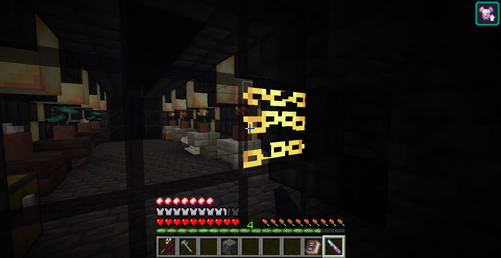
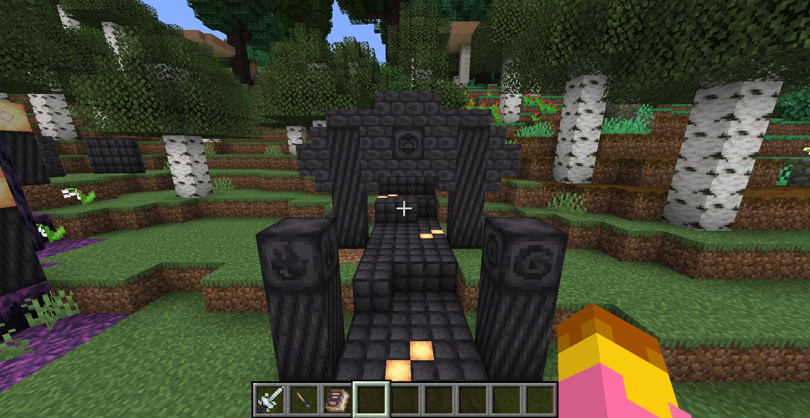
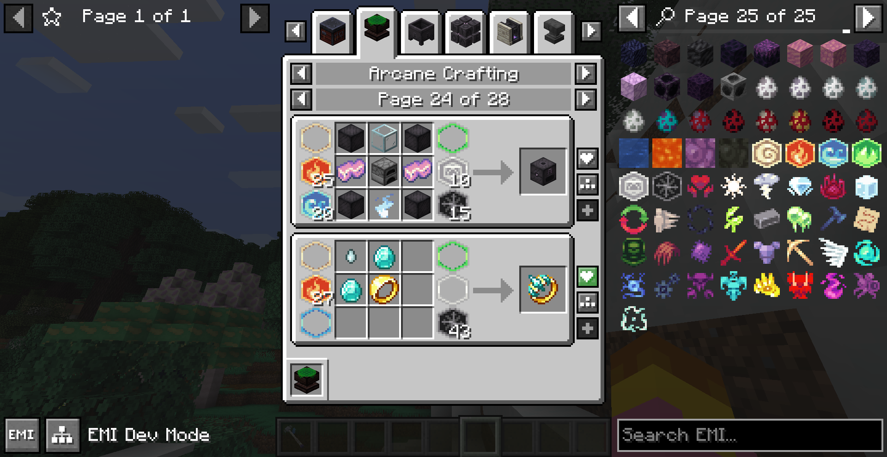

# arcana ex
a magic mod, inspired by thaumcraft. currently developed for fabric 1.21.1, and in alpha.

## alpha versions
you can find the latest release [here](https://github.com/l-Luna/ArcanaEx/releases/latest), alongside details for dependencies and changelogs.

alpha versions are missing a lot of planned content, and worlds made with them may break between updates without warning. however, the mod should be stable and any crashes or bugs should be reported, and there's enough stuff already implemented to play around with.

## screenshots

## datapack customisation
arcana systems generally use data to define content, including research, item aspects, taint conversions, and custom recipe types; these can all be overriden or extended by datapacks. see the `data/arcana/arcana` directory for custom data formats.

## configs
client-side customisation and some server-side data is defined in `<game directory>/config/arcana.toml`. there is no builtin in-game config menu, but [McQoy](https://modrinth.com/mod/mcqoy) adds one usable with arcana's configs.

## discord
over [here](https://discord.gg/pChEeVmaGW)!